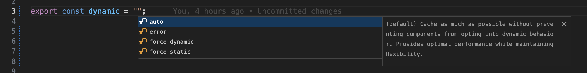
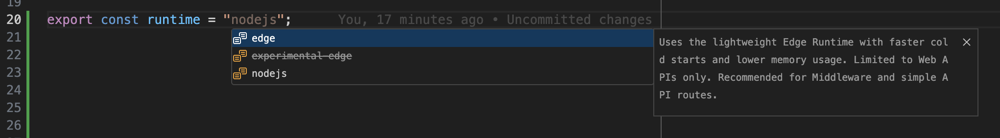
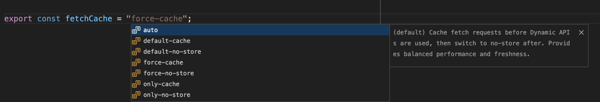

# Next.js Route Config IntelliSense

[](https://github.com/cavalcanteLeo/nextjs-route-config-intellisense/actions/workflows/ci.yml)
[](https://github.com/cavalcanteLeo/nextjs-route-config-intellisense/actions/workflows/auto-release.yml)
[](https://codecov.io/gh/cavalcanteLeo/nextjs-route-config-intellisense)
[](https://github.com/cavalcanteLeo/nextjs-route-config-intellisense/releases)
[](https://marketplace.visualstudio.com/items?itemName=LeonardoCavalcante.nextjs-route-config-intellisense)
[](https://open-vsx.org/extension/LeonardoCavalcante/nextjs-route-config-intellisense)

Intelligent autocompletion for Next.js Route Segment Config exports. Get instant suggestions for all Next.js route configuration options with detailed explanations and proper TypeScript support.

## ✨ Features

- **Complete Route Segment Config Support**: All 8 export types with comprehensive value options
- **Intelligent Context**: Only shows relevant completions in appropriate files
- **Rich Documentation**: Detailed explanations for each configuration option
- **TypeScript & JavaScript**: Full support for `.ts`, `.tsx`, `.js`, and `.jsx` files
- **Performance Optimized**: Lightweight and fast completion suggestions
- **Up-to-date**: Covers all Next.js 14+ configuration options including experimental features

## 🚀 Supported Configurations

### `dynamic`

- `'auto'` - Default behavior, allows dynamic rendering when needed
- `'force-dynamic'` - Forces dynamic rendering for every request
- `'force-static'` - Forces static rendering and caching
- `'error'` - Throws error if dynamic rendering is attempted

### `fetchCache`

- `'auto'` - Default caching behavior
- `'default-cache'` - Forces caching for fetch requests
- `'only-cache'` - Only allows cached fetch requests
- `'force-cache'` - Forces all requests to be cached
- `'force-no-store'` - Forces all requests to skip cache
- `'default-no-store'` - Default to no caching
- `'only-no-store'` - Only allows non-cached requests

### `runtime`

- `'nodejs'` - Node.js runtime (default)
- `'edge'` - Edge runtime for better performance
- `'experimental-edge'` - Deprecated edge runtime

### `preferredRegion`

- `'auto'` - Automatic region selection
- `'global'` - Global deployment
- `'home'` - Deploy to home region

### `dynamicParams`

- `true` - Allow dynamic parameters (default)
- `false` - Disallow dynamic parameters

### `experimental_ppr`

- `true` - Enable Partial Prerendering
- `false` - Disable Partial Prerendering (default)

### `revalidate`

- `false` - Never revalidate
- `0` - Revalidate on every request
- `60` - Revalidate every minute
- `3600` - Revalidate every hour

### `maxDuration`

- `5` - 5 seconds maximum execution time
- `10` - 10 seconds maximum execution time
- `30` - 30 seconds maximum execution time
- `60` - 60 seconds maximum execution time

## 📦 Installation

### VS Code Marketplace

1. Open VS Code
2. Go to Extensions (`Ctrl+Shift+X` / `Cmd+Shift+X`)
3. Search for "Next.js Route Config IntelliSense"
4. Click Install

### Open VSX Registry (for Cursor, VSCodium, etc.)

1. Open your editor
2. Go to Extensions
3. Search for "Next.js Route Config IntelliSense"
4. Click Install

### Manual Installation

1. Download the latest `.vsix` file from [GitHub Releases](https://github.com/cavalcanteLeo/nextjs-route-config-intellisense/releases)
2. Install via command line: `code --install-extension nextjs-route-config-intellisense-x.x.x.vsix`

## 🎯 Usage

1. **Create or open a Next.js route file** (e.g., `app/page.tsx`, `app/layout.tsx`)
2. **Start typing an export statement**: `export const `
3. **Trigger autocomplete** (`Ctrl+Space` / `Cmd+Space`)
4. **Select from available options** with detailed descriptions

### Example

```typescript
// In app/page.tsx
export const dynamic = 'force-static';
export const revalidate = 3600;
export const runtime = 'edge';
export const fetchCache = 'force-cache';
```

## 📸 Examples in Action

See the extension in action with intelligent autocompletion for Next.js Route Segment Config exports:

### Dynamic Export Autocompletion


_Intelligent suggestions for `dynamic` export with detailed descriptions of each option_

### Runtime Export Autocompletion


_Smart completion for `runtime` export showing Node.js and Edge runtime options_

### FetchCache Export Autocompletion


_Comprehensive `fetchCache` options with performance-focused descriptions_

The extension provides:

- **Context-aware suggestions** that only appear when relevant
- **Rich descriptions** explaining the purpose and impact of each option
- **Performance insights** to help you make informed decisions
- **Type safety** with proper TypeScript integration

## 🔄 Automated Release System

This extension uses a fully automated release system powered by semantic-release:

### How It Works

- **Automatic Versioning**: Version numbers are determined by commit message types
- **Instant Publishing**: New releases are automatically published to both VS Code Marketplace and Open VSX Registry
- **Changelog Generation**: Release notes are automatically generated from commit messages
- **Zero Manual Work**: No need to manually create releases or update version numbers

### Version Bumps

- `feat:` commits → **Minor version** (0.1.0 → 0.2.0)
- `fix:` commits → **Patch version** (0.1.0 → 0.1.1)
- `BREAKING CHANGE:` → **Major version** (1.0.0 → 2.0.0)
- Other types (`docs:`, `chore:`, etc.) → **No version bump**

This ensures users always get the latest features and fixes automatically!

## 🛠️ Development

### Prerequisites

- Node.js 20.x or higher
- npm (comes with Node.js)
- VS Code or Cursor

### Setup

```bash
# Clone the repository
git clone https://github.com/cavalcanteLeo/nextjs-route-config-intellisense.git
cd nextjs-route-config-intellisense

# Install dependencies
npm install

# Install git hooks
npm run prepare
```

### Development Commands

```bash
# Run tests
npm test

# Run tests with coverage
npm run test:coverage

# Run linting
npm run lint

# Fix linting issues
npm run lint:fix

# Format code
npm run format

# Check formatting
npm run format:check

# Compile TypeScript
npm run compile

# Watch for changes
npm run watch
```

### Testing the Extension

1. Open the project in VS Code
2. Press `F5` to launch Extension Development Host
3. Test the extension in the new window
4. Create a Next.js file and test autocompletion

## 🤝 Contributing

We welcome contributions! Please see our [Contributing Guide](CONTRIBUTING.md) for details.

### Quick Start for Contributors

1. **Fork the repository**
2. **Create a feature branch**: `git checkout -b feat/your-feature`
3. **Make your changes** following our code standards
4. **Write tests** for new functionality
5. **Use conventional commits**: `git commit -m "feat: add new feature"`
6. **Push and create a PR**

All commits must follow [Conventional Commits](https://www.conventionalcommits.org/) format for automatic versioning.

## 📊 Code Coverage

This project maintains high code coverage standards:

- **Function Coverage**: 100%
- **Statement Coverage**: 97%+
- **Branch Coverage**: 79%+

Coverage reports are automatically generated and uploaded to [Codecov](https://codecov.io/gh/cavalcanteLeo/nextjs-route-config-intellisense).

## 🐛 Issues & Feature Requests

- **Bug Reports**: [GitHub Issues](https://github.com/cavalcanteLeo/nextjs-route-config-intellisense/issues)
- **Feature Requests**: [GitHub Issues](https://github.com/cavalcanteLeo/nextjs-route-config-intellisense/issues)
- **Discussions**: [GitHub Discussions](https://github.com/cavalcanteLeo/nextjs-route-config-intellisense/discussions)

## 📄 License

This project is licensed under the MIT License - see the [LICENSE](LICENSE) file for details.

## 🙏 Acknowledgments

- **Next.js Team** for the comprehensive documentation
- **VS Code Team** for the excellent extension API
- **Contributors** who help improve this extension

## 📈 Stats


---

**Made with ❤️ by [Leonardo Cavalcante](https://github.com/cavalcanteLeo)**
